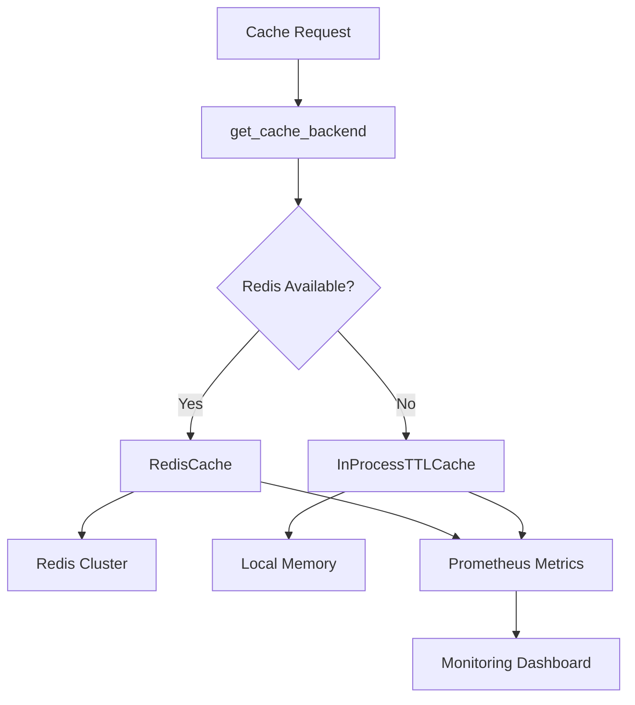

# Redis Cache Integration

## Note on Embedding Model Defaults

As of July 2025, the default embedding provider is Google Gemini with `gemini-embedding-001`. This model supports Matryoshka Representation Learning (MRL) with output dimensions 3072, 1536, or 768. Ensure `settings.EMBEDDING_DIM` matches your selected dimension (default 3072) and the `content_vector VECTOR(<dim>)` column in PostgreSQL. See `docs/5.0-project_phases.md` and `README.md` for configuration examples and migration notes.

## Redis LRU Cache Integration

This document describes the Redis LRU Cache implementation that provides coherent caching across multiple worker processes, eliminating split-brain cache issues and improving response times.

## Overview

The cache system implements a pluggable architecture that supports:

1. **Redis-based caching** for production (multi-worker coherence)
2. **In-memory TTL cache** as fallback for development/testing
3. **Prometheus metrics** for cache performance monitoring
4. **Automatic backend selection** based on Redis availability
5. **Cache coherence** across Gunicorn/uWSGI worker processes
6. **Configurable TTL** and size limits

## Architecture

The cache system follows a factory pattern with automatic backend detection:



### Cache Backends

| Backend | Use Case | Features |
|---------|----------|----------|
| **RedisCache** | Production, multiple workers | Cross-worker coherence, persistence, LRU eviction |
| **InProcessTTLCache** | Development, single worker | Fast access, automatic cleanup, size limits |

## Implementation

### Cache Interface

All cache backends implement a common interface:

```python
class CacheBackend(ABC):
    @abstractmethod
    async def get(self, key: str) -> Optional[Any]:
        """Get a value from the cache."""
        pass

    @abstractmethod
    async def set(self, key: str, value: Any, ttl: int = 3600) -> None:
        """Set a value in the cache with TTL in seconds."""
        pass

    @abstractmethod
    async def delete(self, key: str) -> None:
        """Delete a key from the cache."""
        pass

    @abstractmethod
    async def clear(self) -> None:
        """Clear all cached values."""
        pass

    @abstractmethod
    async def exists(self, key: str) -> bool:
        """Check if a key exists in the cache."""
        pass
```

### Cache Key Generation

Cache keys are generated deterministically for chat responses:

```python
def cache_key_for_chat(question: str, session_id: str = "", model: str = "") -> str:
    """Generate cache key for chat responses."""
    key_parts = [question.strip().lower()]
    if session_id:
        key_parts.append(f"session:{session_id}")
    if model:
        key_parts.append(f"model:{model}")
    
    key_string = "|".join(key_parts)
    return hashlib.sha256(key_string.encode()).hexdigest()[:32]
```

**Key Features:**

- **Case-insensitive** questions for better hit rates
- **Session-aware** caching for user context
- **Model-specific** caching for different LLM providers
- **Fixed-length** SHA256 hash (32 chars) to avoid Redis key limits

### Cached Decorator

The `@cached` decorator provides easy function caching:

```python
@cached(ttl=3600, key_func=cache_key_for_chat_response)
async def get_chat_response_async(question: str, session_id: str) -> Any:
    """Get chat response with caching."""
    response = await llm_chat_engine.chat(question)
    return response
```

**Features:**

- **Automatic cache management** (hit/miss/error handling)
- **Custom key functions** for complex cache keys
- **Error isolation** (cache failures don't break functionality)
- **Metrics integration** for cache performance tracking

## Configuration

### Environment Variables

Add these variables to your `.env` file:

```bash
# Redis Configuration (Used for rate limiting and caching)
REDIS_HOST=redis
REDIS_PORT=6379
REDIS_AUTH=myredissecret
REDIS_TLS_ENABLED=false

# Cache Configuration
CACHE_TTL_SECONDS=3600           # Cache TTL for chat responses (1 hour)
CACHE_MAX_SIZE=1000              # Max entries for in-memory cache fallback
CACHE_ENABLED=true               # Enable/disable caching globally
```

### Settings Integration

The cache system integrates with the existing settings:

```python
class Settings(BaseSettings):
    # Redis for Rate Limiting and Caching
    REDIS_URL: str = "redis://:myredissecret@redis:6379/0"
    
    # Cache Configuration
    CACHE_TTL_SECONDS: int = 3600  # 1 hour default TTL
    CACHE_MAX_SIZE: int = 1000     # Max entries for in-memory cache
    CACHE_ENABLED: bool = True     # Enable/disable caching globally
```

## Redis Configuration

### Production Deployment

For production, configure Redis with LRU eviction policy:

```bash
# Redis configuration for production caching
redis-server --maxmemory 256mb --maxmemory-policy allkeys-lru
```

**Docker Compose Configuration:**

```yaml
redis:
  image: redis:7-alpine
  command: redis-server --maxmemory 256mb --maxmemory-policy allkeys-lru --requirepass myredissecret
  ports:
    - "6379:6379"
  volumes:
    - redis_data:/data
```

### Memory Management

| Policy | Description | Use Case |
|--------|-------------|----------|
| `allkeys-lru` | **Recommended** - Remove least recently used keys | General caching |
| `volatile-lru` | Remove LRU keys with TTL set | Mixed cache/persistent data |
| `allkeys-random` | Remove random keys | Equal access pattern |

### High Availability

For production high availability:

```yaml
redis-sentinel:
  image: redis:7-alpine
  command: redis-sentinel /etc/redis/sentinel.conf
  
redis-cluster:
  image: redis:7-alpine
  command: redis-server --cluster-enabled yes --cluster-config-file nodes.conf
```

## Performance Metrics

The cache system exposes comprehensive Prometheus metrics:

### Cache Performance Metrics

| Metric | Type | Description | Labels |
|--------|------|-------------|---------|
| `cache_hits_total` | Counter | Total cache hits | `backend` |
| `cache_misses_total` | Counter | Total cache misses | `backend` |
| `cache_evictions_total` | Counter | Total cache evictions | `backend` |
| `cache_errors_total` | Counter | Total cache errors | `backend`, `operation` |

### Query to Monitor Cache Hit Rate

```promql
# Cache hit rate (target: ≥80%)
rate(cache_hits_total[5m]) / (rate(cache_hits_total[5m]) + rate(cache_misses_total[5m]))

# Cache error rate (target: <1%)
rate(cache_errors_total[5m]) / (rate(cache_hits_total[5m]) + rate(cache_misses_total[5m]))
```

### Grafana Dashboard Queries

```promql
# Hit rate by backend
sum(rate(cache_hits_total[5m])) by (backend) / 
sum(rate(cache_hits_total[5m]) + rate(cache_misses_total[5m])) by (backend)

# Cache operations per second
sum(rate(cache_hits_total[5m]) + rate(cache_misses_total[5m])) by (backend)

# Error rate
sum(rate(cache_errors_total[5m])) by (backend, operation)
```

## Cache Statistics API

Access real-time cache statistics via the built-in API:

```python
from app.core.cache import get_cache_stats

# Get comprehensive cache statistics
stats = await get_cache_stats()
```

### Redis Statistics Response

```json
{
  "backend": "redis",
  "timestamp": 1640995200.0,
  "redis_used_memory": 2048576,
  "redis_connected_clients": 10,
  "redis_keyspace_hits": 15000,
  "redis_keyspace_misses": 3000,
  "hit_rate": 0.833
}
```

### In-Memory Statistics Response

```json
{
  "backend": "memory",
  "timestamp": 1640995200.0,
  "memory_cache_size": 150,
  "memory_cache_max_size": 1000,
  "memory_cache_default_ttl": 3600
}
```

## Advanced Features

### Cache Invalidation

Pattern-based cache invalidation for Redis:

```python
# Invalidate all cache entries for a user
deleted_count = await invalidate_cache_pattern("user:123:*")

# Invalidate all entries for a specific model
deleted_count = await invalidate_cache_pattern("*:model:gpt-4:*")
```

### Cache Warming

Pre-populate cache with frequently accessed data:

```python
# Warm cache with common questions
common_questions = [
    "What is the company policy?",
    "How do I request time off?",
    "What are the benefits?",
]

for question in common_questions:
    cache_key = cache_key_for_chat(question, "", "default")
    if not await cache.exists(cache_key):
        response = await get_chat_response_async(question, "system")
        await cache.set(cache_key, response, ttl=7200)  # 2 hours
```

### Cache Coherence Testing

Verify cache coherence across workers:

```python
async def test_cache_coherence():
    """Test cache coherence across simulated workers."""
    cache1 = await get_cache_backend()  # Worker 1
    cache2 = await get_cache_backend()  # Worker 2
    
    # Worker 1 sets data
    await cache1.set("shared_key", {"data": "shared"}, ttl=300)
    
    # Worker 2 should see the same data
    result = await cache2.get("shared_key")
    assert result == {"data": "shared"}
```

## Integration with Chat Engine

The cache system is integrated into the chat response pipeline:

```python
@vector_metrics.time_vector_search
@cached(ttl=settings.CACHE_TTL_SECONDS, key_func=_cache_key_for_chat_response)
async def get_chat_response_async(question: str, session_id: str) -> Any:
    """Get chat response with caching and performance monitoring."""
    loop = asyncio.get_event_loop()
    response = await loop.run_in_executor(None, chat_engine.chat, question)
    return response
```

### Cache Key Strategy

Cache keys include all relevant factors that affect responses:

1. **Question content** (case-insensitive, whitespace-normalized)
2. **Session ID** (for context-aware caching)
3. **Model name** (different models may give different answers)

This ensures cache hits only occur for truly equivalent requests.

## Deployment Notes

### Redis LRU Configuration

Redis is pre-configured as an LRU (Least Recently Used) cache in our Docker setup:

```yaml
# docker-compose.yml
redis:
  image: redis:7-alpine
  command: >
    --requirepass ${REDIS_AUTH:-myredissecret}
    --maxmemory ${REDIS_MAXMEMORY:-400mb}
    --maxmemory-policy allkeys-lru
```

#### LRU Configuration Options

| Setting | Value | Description |
|---------|-------|-------------|
| `maxmemory` | `400mb` (configurable) | Maximum memory Redis can use before eviction |
| `maxmemory-policy` | `allkeys-lru` | Evict least recently used keys regardless of expiration |

#### Alternative Eviction Policies

- **`allkeys-lru`** (default): Evicts any least recently used key
- **`volatile-lru`**: Only evicts LRU keys with expiration set
- **`allkeys-random`**: Evicts random keys (faster but less optimal)
- **`volatile-ttl`**: Evicts keys with nearest expiration first

#### Manual Configuration (if needed)

```bash
# Set memory limit at runtime
redis-cli CONFIG SET maxmemory 400mb

# Set LRU eviction policy
redis-cli CONFIG SET maxmemory-policy allkeys-lru

# Verify configuration
redis-cli CONFIG GET maxmemory*
```

### Production Checklist

- [x] Configure Redis with `maxmemory-policy allkeys-lru` ✅
- [x] Set appropriate `maxmemory` limit (400MB default) ✅  
- [ ] Enable Redis persistence if needed (`appendonly yes`)
- [ ] Monitor cache hit rate (target: ≥80%)
- [ ] Set up Redis monitoring and alerting
- [ ] Configure Redis clustering for high availability
- [ ] Test cache coherence across multiple app instances

### Scaling Considerations

| Workers | Redis Memory | Expected Hit Rate | Notes |
|---------|--------------|-------------------|-------|
| 1-2 | 64MB | 70-80% | Development |
| 3-5 | 128MB | 80-85% | Small production |
| 6-10 | 256MB | 85-90% | Medium production |
| 10+ | 512MB+ | 90%+ | Large production |

### Monitoring & Alerting

Set up alerts for:

- **Cache hit rate < 80%** (indicates ineffective caching)
- **Cache error rate > 1%** (indicates Redis connectivity issues)
- **Redis memory usage > 90%** (indicates need for memory increase)
- **Redis connection failures** (indicates infrastructure issues)

## Testing

The cache system includes comprehensive tests:

```bash
# Run cache-specific tests
pytest tests/test_cache.py -v

# Test with fakeredis for Redis simulation
pytest tests/test_cache.py::test_cache_coherence_across_workers -v

# Performance tests
pytest tests/test_cache.py::test_cache_performance_improvement -v

# Hit rate validation
pytest tests/test_cache.py::test_cache_hit_rate_calculation -v
```

### Test Coverage

- ✅ **Redis cache operations** (get, set, delete, clear, exists)
- ✅ **In-memory cache operations** with TTL and LRU eviction
- ✅ **Cache coherence** across simulated workers
- ✅ **Cache hit rate validation** (≥80% target)
- ✅ **Error handling and fallback** behavior
- ✅ **Metrics integration** and counter verification
- ✅ **Cache invalidation** patterns
- ✅ **Performance improvements** measurement

## Troubleshooting

### Common Issues

#### Cache Not Working

```bash
# Check Redis connectivity
redis-cli -h redis -p 6379 -a myredissecret ping

# Check cache backend selection
curl http://localhost:8000/api/v1/cache/stats
```

#### Low Hit Rate

- **Verify cache keys** are deterministic
- **Check TTL settings** (too short = frequent misses)
- **Monitor question variations** (case, whitespace differences)
- **Review session ID usage** (too granular = poor sharing)

#### Redis Memory Issues

```bash
# Check Redis memory usage
redis-cli -h redis -p 6379 -a myredissecret info memory

# Check eviction policy
redis-cli -h redis -p 6379 -a myredissecret config get maxmemory-policy
```

#### Worker Coherence Problems

- **Verify same Redis instance** is used by all workers
- **Check cache key prefixes** are consistent
- **Test with pattern invalidation** to force refresh

### Performance Tuning

| Parameter | Development | Production | Notes |
|-----------|-------------|------------|-------|
| `CACHE_TTL_SECONDS` | 1800 (30min) | 3600 (1hr) | Balance freshness vs performance |
| `CACHE_MAX_SIZE` | 500 | 2000+ | In-memory fallback capacity |
| Redis `maxmemory` | 64MB | 256MB+ | Based on worker count |
| Redis `timeout` | 5s | 10s | Connection timeout |

## Migration Notes

### From In-Memory to Redis

1. **Update configuration** to include Redis settings
2. **Deploy Redis infrastructure** with LRU policy
3. **Test cache coherence** across workers
4. **Monitor hit rates** during transition
5. **Verify performance improvements**

### Cache Invalidation Strategy

When deploying model updates or configuration changes:

```python
# Clear all cache entries
await (await get_cache_backend()).clear()

# Or pattern-based invalidation
await invalidate_cache_pattern("*")
```

## Future Enhancements

- **Cache preloading** for common questions
- **Distributed cache warming** across workers
- **Cache compression** for large responses
- **Cache partitioning** by tenant/organization
- **Advanced eviction policies** (FIFO, LFU)
- **Cache analytics** dashboard in Streamlit demo

---

The Redis LRU Cache integration provides a robust, scalable caching solution that eliminates cache coherence issues while delivering significant performance improvements for the chat API.

## Local Celery Worker/Beat

Add Celery background processing with Redis broker:

```bash
# Start app + infra
docker compose up -d app postgres redis

# Or start background processors via Compose
docker compose up -d celery-worker celery-beat
```

You can also run the commands manually without Docker if preferred:

```bash
celery -A app.core.jobs.celery_app worker --loglevel=INFO
celery -A app.core.jobs.celery_app beat --loglevel=INFO
```

Tasks are defined under `app/core/jobs.py`:

- `process_document_async(job_id, document_data)`
- `scrape_url_async(job_id, url, options)`
- `cleanup_failed_jobs()`

These are stubs and will be fully wired to the ingestion engine in follow-up sprints.

## Ingest Metrics

Basic ingest metrics are exposed when using Prometheus backend:

- `ingest_requests_total{status}`: total ingest requests (status: accepted|rejected)
- `ingest_latency_seconds{status}`: validation/enqueue latency histogram

Validation outcomes are logged with structured fields `filename`, `content_type`, `size_bytes`.
